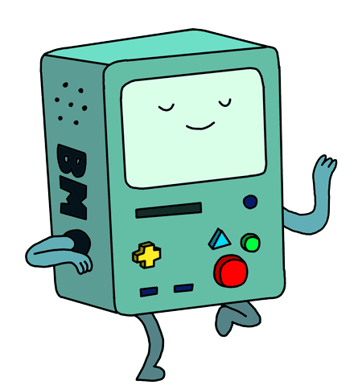
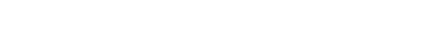

#  </p>

<p>


 

</p>

```diff
- 🎓 I earned a Bachelor's degree in Software Engineering in 2025.
+ 💻 I work as a Front-end Engineer at Tencent, Shenzhen at present.

- 🍄 I have a passion for using code to make a difference in the world.
+ 🌴 I build a lot of open-source projects to explore creative ideas.
```